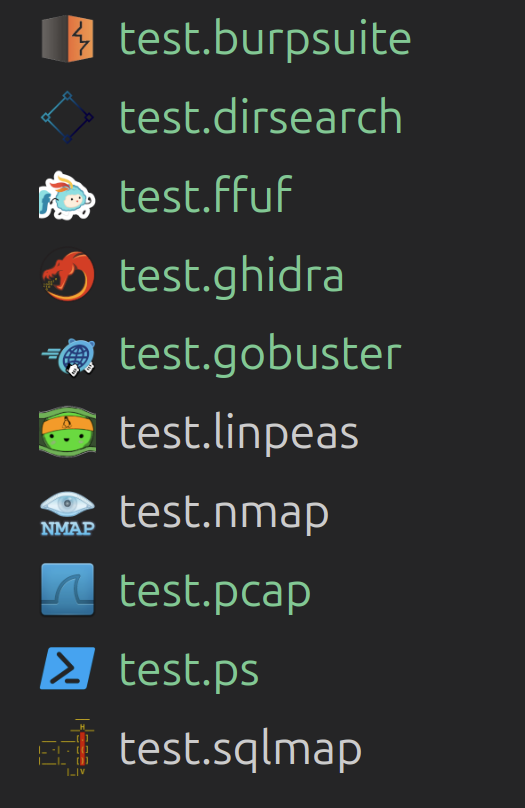

# Iconic-BlackOps

## installing
`npm install -g vsce`
`[$] code --install-extension hack-theme-0.0.3-rc1.vsix` or `code --insta...`

---

#### dev requirements
`npm install -g vsce`
please use code and not codium. the codium deletes your whole folder sometimes :S

### refresh changes
- `$ vsce package`
- quit vs code
- `$ codium --install-extension hack-theme/hack-theme-0.0.1.vsix`
- back to vs code

---

# supported extensions and single files list

---

### add new icon

- add new 64x64 png icon with transparent background to icons/ folder
- add icon entry similar to others to icons/icons.json
- change version to newer in package.json
- run  `$ vsce package`
- run `$ codium --install-extension hack-theme/hack-theme-0.0.[your version].vsix`

---

## TODO:
- add proper file extensions like .iso for ghidra
- get some default json, txt, zip, php, py
- passwd, common LOOT files as a good list in the json config files
- #0a961e for green terminal note
- jos /etc/passwd näyttää liian pieneltä, ni laita vaan lootin kuva kaikkiin tollasiin