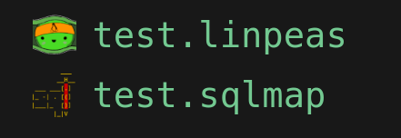

# Iconic-BlackOps

### at the moment only .linpeas and .sqlmap is made to work. WIP

dev requirements
`npm install -g vsce`
please use code and not codium. the codium deletes your whole folder sometimes :S

### refresh changes
- `$vsce package`
- quit vs code
- `$ codium --install-extension hack-theme/hack-theme-0.0.1.vsix`
- back to vs code

